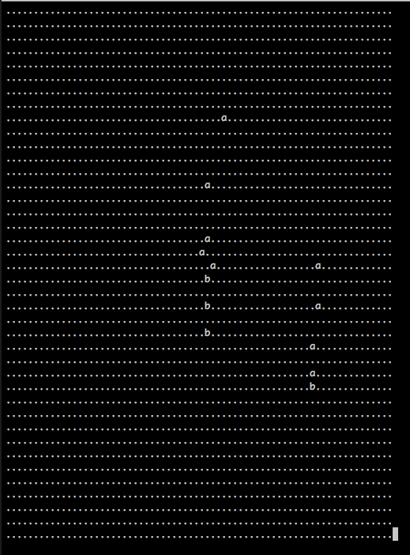
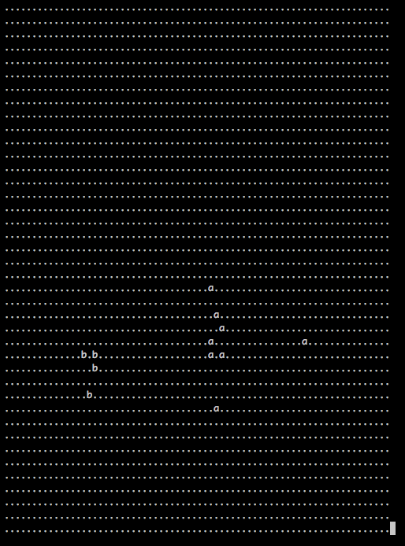
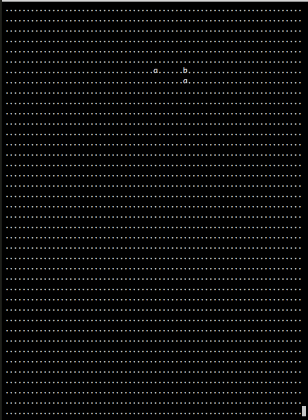

# Lem-ipc

This C solo project is all about the notion of shared memory. For all shared memory usage and information,
I recommend [this documentation](https://users.cs.cf.ac.uk/Dave.Marshall/C/node27.html).

Lem-ipc is a game where several teams of players fight on a 2D board. When a player is surrounded
by two or more players of another team, the player dies.

However, the goal here is not to create a "game" as we imagine it. Indeed, players must all be separate processes
(created through fork()) and live on the same board. This is where the shared memory comes into play.

The board is a segment of shared memory allocated by the first players, and every other players/process access it to play,
with the help of a shared key.

This means all players do not play in order. They play when they manage to access and lock the segment of memory of the board.
There is no rule to decide when it is a player's turn, the first one to access the board through the system's task scheduler is
the one who will play.

Example output:

